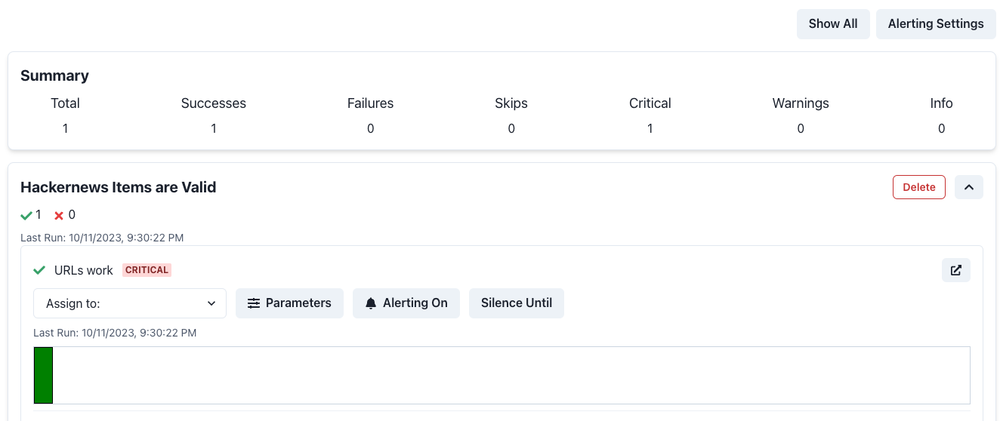
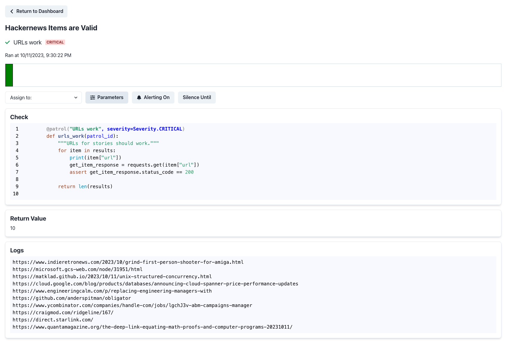

#  Panda Patrol
  

**Add dashboards, alerting, and silencing to your data tests with < 10  lines of code.**

**Questions and feedback** 

Email: ivanzhangofficial@gmail.com

Call: https://calendly.com/aivanzhang/chat

<!-- **See [Dagster]()** on how to add panda patrols into your Dagster-based data pipelines.

**See [Airflow]()** on how to add panda patrols into your Airflow-based data pipelines.

**See [DBT]()** on how to add panda patrols into your DBT-based data pipelines. -->

## Overview
Wrap your existing data tests within data pipelines to automatically generate dashboards, alerting, and silencing. Currently this library does not deal with the orchestration of these data tests. However this may be added in the future depending on demand.


## Quickstart
### 1) Installation
Install the latest version of panda-patrol using pip:
```bash
pip install panda-patrol
```
### 2) Setup the environment variables
In an existing or new `.env` file, set the following environment variables:
```bash
PANDA_PATROL_URL
PANDA_PATROL_ENV
PANDA_DATABASE_URL
SMTP_SERVER
SMTP_PORT
SMTP_USER
SMTP_PASS
PATROL_EMAIL
```
See [`.env.example`](https://github.com/aivanzhang/panda-patrol/tree/main/;env.example) for more information about how to set these environment variables.
### 3) Start the panda-patrol server. This should spin up a website at `PANDA_PATROL_URL`.
```bash
python -m panda_patrol
```
### 4) Wrap your existing data tests
Before (`hello-dagster.py` from https://docs.dagster.io/getting-started/hello-dagster):
```python
def hackernews_top_stories(context: AssetExecutionContext):
    """Get items based on story ids from the HackerNews items endpoint."""
    with open("hackernews_top_story_ids.json", "r") as f:
        hackernews_top_story_ids = json.load(f)

    results = []
	# Get information about each item including the url
    for item_id in hackernews_top_story_ids:
        item = requests.get(
            f"https://hacker-news.firebaseio.com/v0/item/{item_id}.json"
        ).json()
        results.append(item)

        # DATA TEST: Make sure that the item's URL is a valid URL
        for item in results:
			print(item["url"])
			get_item_response = requests.get(item["url"])
			assert get_item_response.status_code == 200
    ...
```
After:
```diff
+ from panda_patrol.patrols import patrol_group, Severity
...
def hackernews_top_stories(context: AssetExecutionContext):
    """Get items based on story ids from the HackerNews items endpoint."""
    with open("hackernews_top_story_ids.json", "r") as f:
        hackernews_top_story_ids = json.load(f)

    results = []
	# Get information about each item including the url
    for item_id in hackernews_top_story_ids:
        item = requests.get(
            f"https://hacker-news.firebaseio.com/v0/item/{item_id}.json"
        ).json()
        results.append(item)

    # DATA TEST: Make sure that the item's URL is a valid URL
+   with patrol_group("Hackernews Items are Valid") as patrol:
+	@patrol("URLs work", severity=Severity.CRITICAL)
+	def urls_work(patrol_id):
		"""URLs for stories should work."""
		for item in results:
			print(item["url"])
			get_item_response = requests.get(item["url"])
			assert get_item_response.status_code == 200
		
		return len(results)
    ...
```
### 5) Run your data pipeline
Run your data pipelines as you normally would. Here we use dagster to run the data tests. However, you can use whatever Python-based data pipeline.
```bash
dagster dev -f hello-dagster.py
```

### 6) View the results
Go to `PANDA_PATROL_URL` to view the results of your data tests. You should see something like this:

**Main page**

**Results page of a specific data test run**


:tada: Congrats! :tada: You have created your first data test minitor! See the [documentation](https://github.com/aivanzhang/panda-patrol/wiki) for more information on other features like adjustable parameters, alerting, and silencing.
