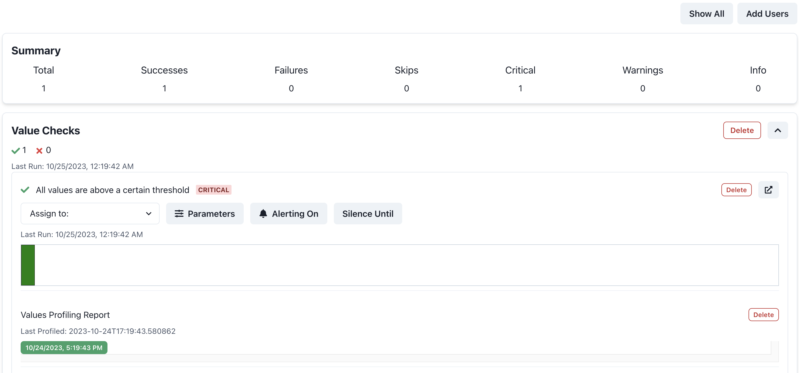

# Add Panda Patrols to your Airflow Data Tests
This example shows how Panda Patrols can be added to data tests inside your Airflow DAGs. It creates a basic Airflow DAG with a single task `get_values_task` task that has a list of values (that it has gotten from somewhere) and runs a few tests on that list of values. Patrols are already setup for the tests. 

## TLDR
**Without Panda Patrols**
```python
...
def get_values():
    data = [
        {"id": 1, "value": 100},
        {"id": 2, "value": 200},
        {"id": 3, "value": 0},
    ]
    for entry in data:
        assert (
            entry["value"] != 0
        ), f"Entry with id {entry['id']} has zero value!"
...
```
**With Panda Patrols**

This file is located at `dags/get_values.py`
```diff
+ from panda_patrol.patrols import patrol_group
+ os.environ["no_proxy"] = "*" # This is needed to make sure that the requests library works properly
...
def get_values():
    data = [
        {"id": 1, "value": 100},
        {"id": 2, "value": 200},
        {"id": 3, "value": 0},
    ]

+   # Simple test: Ensure no "value" field in the dataset is zero
+   with patrol_group(
+       "Value Checks",
+   ) as patrol:
+       @patrol("All values are non-zero")
+       def no_zero_values(patrol_id):
            for entry in data:
                assert (
                    entry["value"] != 0
                ), f"Entry with id {entry['id']} has zero value!"
    ...
```

## Setup
1. Run the setup script. This configures Airflow and then installs the airflow and panda-patrol packages. Finally it starts running the Airflow server.
    ```bash
    chmod +x setup.sh
    ./setup.sh
    ```
2. Modify the `.env`. Note that the `SMTP_*` and `PATROL_EMAIL` values are dummy values. You will need to replace them with your own values. 
3. Start the panda-patrol server. This is needed to run the patrols.
    ```bash
    python -m panda_patrol
    ```
4. Open the Airflow UI at http://localhost:8080/ and login with the default username and password.
5. Turn on the `get_values_dag` DAG and trigger it. You may need to refresh the page to see the DAG. You should see the patrols running in the logs.
6. After the DAG finishes, you should see the results of the patrols in the panda-patrol UI at http://localhost:8000. It should look like
    

:tada: Congrats! :tada: You have now added Panda Patrols to Airflow! See the [documentation](https://github.com/aivanzhang/panda_patrol/wiki) for more information on other features like adjustable parameters, alerting, and silencing.
