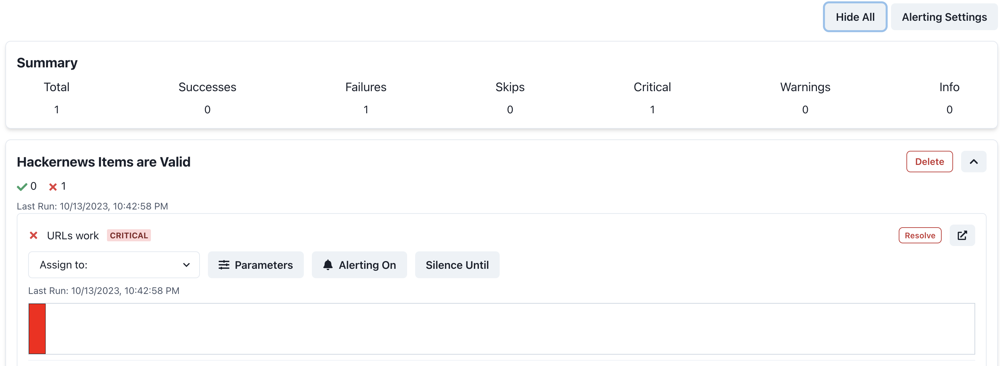

# Integrate Panda Patrols with Dagster
This example shows how Panda Patrols can be integrated with your Dagster DAGs. It creates a basic Dagster DAG with two assets `hackernews_top_story_ids` and `hackernews_top_stories` (which depends on the previous one). See [hello-dagster.py](hello-dagster.py) for the code. `hackernews_top_stories` pulls details about top stories and has data tests with respect to each story's link. Patrols are already setup for these test. Furthermore it profiles these urls and stores it in Panda Patrol.

## Setup
1. Install the requirements. This installs the necessary dependencies for dagster, panda patrol, and the ydata profiling library package.
    ```bash
    pip install -r requirements.txt
    ```
2. Start the Dagster server.
    ```bash
    dagster dev -f hello-dagster.py
    ```
3. Modify the `.env`. Note that the `SMTP_*` and `PATROL_EMAIL` values are dummy values. You will need to replace them with your own values if you want email alerts. `SLACK_WEBHOOK` is also a dummy value. You will need to replace it with your own value if you want slack alerts.
4. Start the Panda Patrol server.
    ```bash
    python -m panda_patrol
    ```
5. Open the Dagster UI at http://localhost:3000/ and materialize the `hackernews_top_story_ids` and `hackernews_top_stories` assets.
6. After the assets finish, you should see the results of the patrols in the Panda Patrol UI at http://localhost:8000. It should look like
    

:tada: Congrats! :tada: You have now added Panda Patrols to Dagster! See the [documentation](https://github.com/aivanzhang/panda_patrol/wiki) for more information on other features like adjustable parameters, alerting, and silencing.