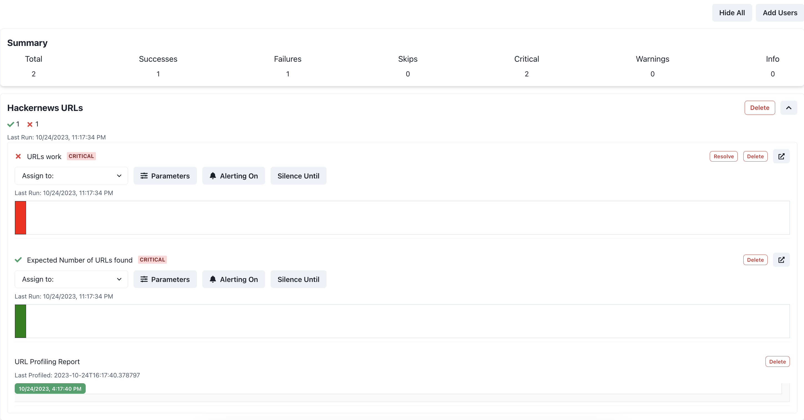

# Add Panda Patrols to your Dagster Data Tests
This example shows how Panda Patrols can be added to data tests inside your Dagster DAGs. It creates a basic Dagster DAG with two assets `hackernews_top_story_ids` and `hackernews_top_stories` (which depends on the previous one). `hackernews_top_stories` pulls details about top stories and has a check to make sure that each story's link actually works. Patrols are already setup for this test. 

## TLDR
**Without Panda Patrols**
```python
def hackernews_top_stories(context: AssetExecutionContext):
    """Get items based on story ids from the HackerNews items endpoint."""
    with open("hackernews_top_story_ids.json", "r") as f:
        hackernews_top_story_ids = json.load(f)

    results = []
	# Get information about each item including the url
    for item_id in hackernews_top_story_ids:
        item = requests.get(
            f"https://hacker-news.firebaseio.com/v0/item/{item_id}.json"
        ).json()
        results.append(item)

        # DATA TEST: Make sure that the item's URL is a valid URL
        for item in results:
		print(item["url"])
		get_item_response = requests.get(item["url"])
		assert get_item_response.status_code == 200
    ...
```
**With Panda Patrols**

This file is located in `hello-dagster.py`
```diff
+ from panda_patrol.patrols import patrol_group
...
def hackernews_top_stories(context: AssetExecutionContext):
    """Get items based on story ids from the HackerNews items endpoint."""
    with open("hackernews_top_story_ids.json", "r") as f:
        hackernews_top_story_ids = json.load(f)

    results = []
	# Get information about each item including the url
    for item_id in hackernews_top_story_ids:
        item = requests.get(
            f"https://hacker-news.firebaseio.com/v0/item/{item_id}.json"
        ).json()
        results.append(item)

    # DATA TEST: Make sure that the item's URL is a valid URL
+   with patrol_group("Hackernews Items are Valid") as patrol:
+	@patrol("URLs work")
+	def urls_work(patrol_id):
		"""URLs for stories should work."""
		for item in results:
			print(item["url"])
			get_item_response = requests.get(item["url"])
			assert get_item_response.status_code == 200
		
		return len(results)
    ...
```

## Setup
1. Install the requirements.
    ```bash
    pip install -r requirements.txt
    ```
2. Start the Dagster server.
    ```bash
    dagster dev -f hello-dagster.py
    ```
3. Modify the `.env`. Note that the `SMTP_*` and `PATROL_EMAIL` values are dummy values. You will need to replace them with your own values. 
4. Start the panda-patrol server. This is needed to run the patrols.
    ```bash
    python -m panda_patrol
    ```
5. Open the Dagster UI at http://localhost:3000/ and materialize the `hackernews_top_story_ids` and `hackernews_top_stories` assets.
6. After the assets finish, you should see the results of the patrols in the panda-patrol UI at http://localhost:8000. It should look like
    

:tada: Congrats! :tada: You have now added Panda Patrols to Dagster! See the [documentation](https://github.com/aivanzhang/panda_patrol/wiki) for more information on other features like adjustable parameters, alerting, and silencing.