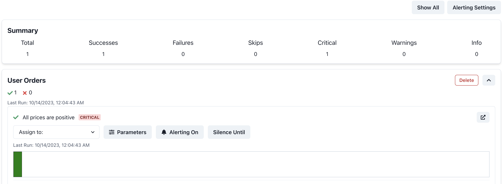

# Add Panda Patrols to your DBT Data Tests
This example shows how Panda Patrols can be added to data tests inside your DBT pipeline. It creates several DBT models ([models](models)) and also a Python DBT model ([user_orders_products_view](models/user_orders_products_view.py)). This Python-based model is needed for our Python-based Panda Patrols. Furthermore when using Panda Patrols in DBT, your patrol code will not be stored. Patrols are set up for this Python model.

## TLDR
**Without Panda Patrols**
```python
...
def model(dbt, session):
    users_df = dbt.ref("users_view")
    orders_df = dbt.ref("orders_view")
    products_df = dbt.ref("products_view")

    user_orders_df = users_df.merge(orders_df, on="user_id", how="inner")
    final_df = user_orders_df.merge(products_df, on="product_name", how="inner")

    assert (final_df["product_price"] > 0).all()
    print("All prices are positive")

    return final_df
    ...
```
**With Panda Patrols**

This file is located in `models/user_orders_products_view.py`.
```diff
+ from panda_patrol.patrols import patrol_group
...
def model(dbt, session):
    users_df = dbt.ref("users_view")
    orders_df = dbt.ref("orders_view")
    products_df = dbt.ref("products_view")

    user_orders_df = users_df.merge(orders_df, on="user_id", how="inner")
    final_df = user_orders_df.merge(products_df, on="product_name", how="inner")

+   with patrol_group("User Orders") as patrol:
+       @patrol("All prices are positive")
+       def prices_are_positive(patrol_id):
            assert (final_df["product_price"] > 0).all()
            print("All prices are positive")

    return final_df
    ...
```

## Setup
1. Install the requirements. This installs the necessary dependencies for DBT and Panda Patrol. Note that we're using `dbt-postgres` as the adapter. You can use any adapter you want, but you will need to modify the `profiles.yml` accordingly. Furthermore, we're using [dbt-fal](https://github.com/fal-ai/dbt-fal) which provides further Python compatibility with DBT. 
    ```bash
    pip install -r requirements.txt
    ```
2. Make sure your `profiles.yml` is set up correctly. An example is provided in this directory [profiles.yml](profiles.yml). Note that in addition to the basic dbt options, we have added options needed for dbt-fal (see more details [here](https://github.com/fal-ai/dbt-fal/tree/main/projects/adapter#2-update-your-profilesyml-and-add-the-fal-adapter)).

3. Modify the `.env`. Note that the `SMTP_*` and `PATROL_EMAIL` values are dummy values. You will need to replace them with your own values. 
4. Start the Panda Patrol server. This is needed to run the patrols.
    ```bash
    python -m panda_patrol
    ```
5. Run the DBT pipeline. This will create the models and run the patrols.
    ```bash
    dbt run
    ```
6. After the assets finish, you should see the results of the patrols in the Panda Patrol UI at http://localhost:8000. It should look like
    

:tada: Congrats! :tada: You have now added Panda Patrols to DBT! See the [documentation](https://github.com/aivanzhang/panda_patrol/wiki) for more information on other features like adjustable parameters, alerting, and silencing.